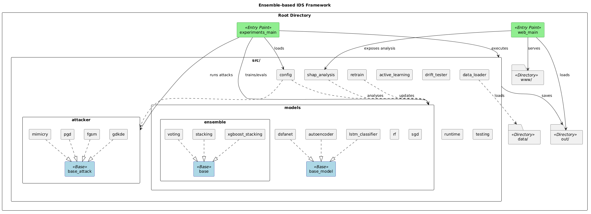

# Ensemble-based Anomaly Detection for Cybersecurity

This repository contains the implementation of an ensemble-based Network Intrusion Detection System (NIDS).

## One-Liner Quick Start

Windows:

- `setup.ps1 -Cuda cu130` to set up the environment. (Or replace `cu130` with your CUDA version or `cpu`)
- `run_experiments.ps1` to execute the full experiment pipeline on all three datasets sequentially.
- `run_web.ps1` to start the web dashboard (both backend and frontend).

Linux/Mac:

- `setup.sh --cuda cu130`
- `run_experiments.sh`
- `run_web.sh`

It is also possible to run the experiments directly with the web dashboard backend (skip the `run_experiments` step), refer to the [Running the Web Dashboard](#running-the-web-dashboard) section below.

For more information on one-liner scripts and parameters, refer to the [One-Liner Scripts Command Reference](#one-liner-scripts-command-reference) section below.

## Project Structure



```
ensemble-ids/
├── data/                   # Directory for storing datasets (not included in the repo)
│   ├── NF-UNSW-NB15-v3.csv
│   ├── ...
├── out/                    # Directory for storing experiment results and web export data (not included in the repo)
│   ├── eda/                # Exploratory data analysis results
│   ├── experiments/        # Experiment results
│   │  ├── unsw-main/
│   │  ├── ton-main/
│   │  └── ids2018-main/
│   └── web/                # Web export results
├── src/                    # Source code for the project
│   ├── attacker/             # Adversarial shift code
│   ├── models/               # Model definitions
│   │  └── ensemble/         # Ensemble models
│   ├── ...
├── www/                    # Web dashboard frontend code
├── experiments_main.py      # Entry point for running the experiments
├── poetry.lock
├── pyproject.toml
├── setup.{sh,ps1}
├── run_experiments.{sh,ps1}
├── run_web.{sh,ps1}
├── web_main.py              # Entry point for running the web dashboard backend
```

### Downloading `out/` and `data/`

Due to the size limits, the `out/` directory containing the experiment results and web export data, as well as the `data/` directory containing the datasets, are not included in the repository. Please download them from the following links:

[https://drive.google.com/drive/folders/1FIGpS3oYmJFGZs8uNtYaNZxrHKx0u8d4?usp=sharing](https://drive.google.com/drive/folders/1FIGpS3oYmJFGZs8uNtYaNZxrHKx0u8d4?usp=sharing)

Download and extract the `out.zip` file, and place the extracted `out/` directory in the root of the repository. The path should be like `out/experiments/unsw-main/` and `out/web/`.

Download and extract the `data.zip` file, and place the extracted `data/` directory in the root of the repository. The path should be like `data/NF-UNSW-NB15-v3.csv`.

With `out/` downloaded, you can skip running the experiments and directly start the web dashboard to explore the results.

The datasets used in this project are sourced from the [Netflow V3 Datasets](https://www.kaggle.com/datasets/athena21/netflow-v3-datasets) [1] on Kaggle.

## Detailed Setup and Usage Instructions

### Environment Setup

The project is implemented in Python 3.13 and manages dependencies using [poetry](https://python-poetry.org/). Please install poetry and a Python 3.13 environment before proceeding.

(1) Install base dependencies first:

```bash
poetry install
```

(2) Install PyTorch. The installation command depends on your hardware and CUDA version.

**Note**: You can skip installing PyTorch if you only want to host the web dashboard without running the experiments.

**CPU**:

```bash
poetry run pip install --index-url https://download.pytorch.org/whl/cpu torch
```

**CUDA 13.0**:

```bash
poetry run pip install --index-url https://download.pytorch.org/whl/cu130 torch
```

**Other CUDA versions**:

Replace `cu130` with the appropriate version (e.g., `cu128`, `cu124`, `cu121`, `cu118`, etc.):

```bash
poetry run pip install --index-url https://download.pytorch.org/whl/cu121 torch
```

You can verify the installed backend with:

```bash
poetry run python -c "import torch; print(torch.__version__); print(torch.version.cuda)"
```

It should be noted that the project is only tested with PyTorch 2.10.0 on CUDA 13.0 and CPU. Compatibility with other versions may vary.

(3) Install the web dashboard dependencies:

```bash
cd www
npm install
```

### Running the Experiments

Running the training and evaluation scripts.

**Note**: You can skip this step if you only want to host the web dashboard without running the experiments. 

**Note**: It is also possible to run the experiments directly with the web dashboard backend (skip this step), refer to the [Running the Web Dashboard](#running-the-web-dashboard) section below.

Running the experiments will take a significant amount of time and computational resources, so a GPU is recommended.

```bash
poetry run python experiments_main.py --run-id unsw-main --steps 1,2,3,4,5,6,7,8 --epochs 10,10,20 --base-dataset NF-UNSW-NB15-v3.csv --device cuda
poetry run python experiments_main.py --run-id ton-main --steps 1,2,3,4,5,6,7,8 --epochs 10,10,20 --base-dataset NF-ToN-IoT-v3.csv --device cuda
poetry run python experiments_main.py --run-id ids2018-main --steps 1,2,3,4,5,6,7,8 --epochs 10,10,20 --base-dataset NF-CICIDS2018-v3.csv --device cuda
```

`experiments_main.py` is the entry point for the whole pipeline. A detailed list of parameters and their descriptions can be found in the source code or by running:

```bash
poetry run python experiments_main.py --help
```

Below is a brief description of the parameters used in the above commands:

- `--run-id`: A unique identifier for the experiment run. This will be used to organize the results and logs. If you wish to continue a previous run, use the same `run-id` and specify the steps you want to overwrite.
- `--steps`: A comma-separated list of steps to execute.
    1. Benchmarking the models on the base dataset.
    2. Evaluating the models under various shifts, including natural, label, corruption, and adversarial shifts.
    3. Adversarial retraining of the models.
    4. Evaluating the best ensemble and generating SHAP explanations.
    5. Ablation study for DSFANet.
    6. Ablation study for the ensemble.
    7. Comparative evaluation of transfer ensembles on natural shifts.
    8. Exporting results for the web dashboard.
- `--epochs`: A comma-separated list of the number of epochs for training AutoEncoder, LSTM, and DSFANet, respectively.
- `--base-dataset`: The base dataset to use for training and evaluation. This should be a CSV file located in the `data/` directory.
- `--device`: Options include `cpu`, `cuda`, or a specific CUDA device like `cuda:0`.

The experiments results will be saved in the `out/experiments/<run-id>/` directory, organized by steps.

The web export results will be saved in `out/web/` directory, organized by run IDs.

### Running the Web Dashboard

(1) Starting the backend server:

```bash
poetry run python web_main.py
```

The backend server will start on `http://127.0.0.1:8000/` by default.

Add the `--verbose` flag if you want to see the API request logs in the console.

To run experiments before starting the server, use:

```bash
poetry run python web_main.py --run-experiment --run-id-suffix main --device cuda
```

This will execute the three experiments with run IDs `unsw-main`, `ton-main`, and `ids2018-main` sequentially before starting the server. You can replace `main` with a custom suffix to create different run IDs.

(2) Starting the frontend server:

```bash
cd www
npm start
```

The frontend server will start on `http://localhost:3000/` by default and will automatically open in your default web browser.

### One-Liner Scripts Command Reference

- `setup.ps1`: `./setup.ps1 -Cuda cu130 [-Python 3.13] [-SkipTorch]`
- `setup.sh`: `./setup.sh --cuda cu130 [--python 3.13] [--skip-torch]`
- `run_experiments.ps1`: `./run_experiments.ps1 [-Single] [-RunId unsw-test] [-RunIdSuffix main] [-BaseDataset NF-UNSW-NB15-v3.csv] [-Device cpu|cuda] [-Steps 1,2,3,4,5,6,7,8] [-Epochs 10,10,20] [-SizeLimit 3000] [-OodDataset NF-BoT-IoT-v3.csv]`
- `run_experiments.sh`: `./run_experiments.sh [--single] [--run-id unsw-test] [--run-id-suffix main] [--base-dataset NF-UNSW-NB15-v3.csv] [--device cpu|cuda] [--steps 1,2,3,4,5,6,7,8] [--epochs 10,10,20] [--size-limit 3000] [--ood-dataset NF-BoT-IoT-v3.csv]`
- `run_web.ps1`: `./run_web.ps1 [-BindHost 127.0.0.1] [-BackendPort 8000] [-FrontendPort 3000] [-RunExperiment] [-RunIdSuffix main] [-Device cpu|cuda] [-Verbose] [-BackendOnly] [-FrontendOnly]`
- `run_web.sh`: `./run_web.sh [--bind-host 127.0.0.1] [--backend-port 8000] [--frontend-port 3000] [--run-experiment] [--run-id-suffix main] [--device cpu|cuda] [--verbose] [--backend-only] [--frontend-only]`

### Development Environment

This project is developed and tested on the following environment:

- OS: Microsoft Windows 11 Enterprise
- CPU: Intel Core i7-14700K
- GPU: NVIDIA RTX 4000 Ada Generation 20GB
- Python: 3.13.12
- PyTorch: 2.10.0+cu130

A minimum of 12GB VRAM is recommended to run the experiments due to the large datasets, especially for CIC-IDS2018 and ToN-IoT datasets.

As we only have access to the Windows environment, the `.sh` scripts are provided for reference and may not be fully tested. Apologies for any potential issues.

## Credits

[1] M. Luay, S. Layeghy, S. Hosseininoorbin, M. Sarhan, N. Moustafa, and M. Portmann, “Temporal analysis of NetFlow datasets for network intrusion detection Systems,” *arXiv [cs.LG]*, Mar. 2025, doi: 10.48550/arxiv.2503.04404.
